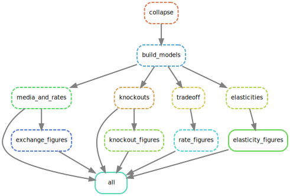

# Additional methods for MICOM

This repo includes workflows and additional data to reproduce the manuscript:

MICOM: Metagenome-Scale Modeling To Infer Metabolic Interactions in the Gut Microbiota <br>
Christian Diener, Sean M. Gibbons, Osbaldo Resendis-Antonio <br>
mSystems 5:e00606-19 <br>
https://doi.org/10.1128/mSystems.00606-19

Additional data is provided in the `data` subdirectory. For now we will assume you
want to start from the abundances and replication rates as those are workflow
steps that pertain to MICOM. See further below on instruction how to go start
from the raw sequencing data.

Note that we only support Linux and Mac here. If you have any questions or problems running the code please don't hesitate to [file an issue](issues).

## Setting up you conda environment

We will use conda to manage all the required dependencies. If you already
have Miniconda or Anaconda you can skip right ahead otherwise you will need
to install Miniconda using [those instructions](https://conda.io/projects/conda/en/latest/user-guide/install/index.html).

Open a Terminal and make sure that conda works.

```bash
conda info
```

Which should look something like this:

```
     active environment : None
            shell level : 0
       user config file : /Users/cdiener/.condarc
 populated config files : /Users/cdiener/.condarc
          conda version : 4.8.0
    conda-build version : 3.18.11
         python version : 3.6.7.final.0
...
           offline mode : False
```

Now either use git to clone this repo or [download the zipped version](https://github.com/micom-dev/paper/archive/master.zip)
and unzip it.

```bash
git clone https://github.com/micom-dev/paper
```

Now switch to the directory containing the downloaded code. For instance

```bash
cd paper
```

Now we can set up an environment that contains 99% of the required software to
run all code in this repo.

```bash
conda env create -f micom.yml
```

Follow this by activating your environment:

```bash
conda activate micom
```

MICOM models all biochemical reactions in all taxa, which means that the optimization problem MICOM solves included hundreds of thousands of variables. There are only a few numerical solvers that can solve quadratic programming problems of that scale. Right, now we support [CPLEX](https://www.ibm.com/products/ilog-cplex-optimization-studio) or [Gurobi](https://gurobi.com), which both have free academic licenses but will require you to sign up for them. We hope to change this in the future by making MICOM compatible with an open-source solver (stay tuned!).

**CPLEX**

After registering and downloading the CPLEX studio for your OS unpack it (by running the provided installer) to a directory of your choice (we will assume it's called `ibm`).

Now install the CPLEX python package:

```bash
pip install ibm/cplex/python/3.6/x86-64_linux
```

Substitute x86-64_linux with the folder corresponding to your system (there will only be one subfolder in that directory).

**Gurobi**

Gurobi can be installed with conda.

```bash
conda install -c gurobi gurobi
```

You will now have to register the installation using your license key.

```bash
grbgetkey YOUR-LICENSE-KEY
```

The analyses in the paper were obtained with CPLEX 12.9.

You are now all set to reproduce the paper.

## Running the workflows

### Download the AGORA models

The only data not supplied in this repository is the AGORA database since it would be
to big. It can be downloaded from https://www.vmh.life/files/reconstructions/AGORA/1.03/AGORA-1.03-With-Mucins.zip .
Unzip this file an transfer all files in `reconstructions/sbml` to the `data/agora` folder.

### Run all steps

We use [snakemake](https://snakemake.readthedocs.io/en/stable/) to define a
reproducible workflow that generates all analyses and panels form the paper.
We do recommend to use the beefiest equipment available to you to use as many
CPU cores as possible (this will speed up everything by a factor of the cores).
You will need approximately 1GB of RAM per core available.

The basic workflow we are running looks like this:



To run the entire workflow from start to finish use:

```bash
snakemake --cores 16
```

This will recreate intermediate files in `data` and figures in `figures`.

Which will run the workflow with 16 cores and will automatically track what
has been run already or what is outdated. So interrupting it will not create
any problems.

Individual workflow steps are kept in the `workflows` as directory as simple
Python files you can inspect to see what is happening in detail.

> The species level workflow is not fully run by default.
> However, species models are always built. If you want to run species
> level tradeoff analyses just change the corresponding files to
> `species_tradeoff*.py` in `Snakefile`.

## Processing the metagenomics data

> This entire part is optional. It will generate `abundances.csv` and
> `replication_rates.csv` which are provided along with this repository.

### Install R and packages

If you want to run the metagenomic analyses as well you will need to install R and some dependencies as well.

```bash
conda activate micom
conda install -c r r-base
```

then open R by typing `R` and install the packages with

```R
install.packages(c("BiocManager", "remotes", "drake"))
setRepositories(ind=1:4)
remotes::install_github("gibbons-lab/mbtools")
```

### Download data

Depending on your setup there may be various ways. The SRA toolkit is installed in the conda environment so you can download fastq files with
`fastq-dump`. The SRA IDs can be found in `data/recent.csv` in the `run_accession` column. For instance using R:

```R
library(data.table)
library(futile.logger)

mkdir("data/raw")

samples = fread("data/recent.csv")

for (sa in samples$run_accession) {
    system2("fasterq-dump",
        c("-O", "data/raw", sa))
    flog.info("Downloaded run %s.", sa)
}
```

You will also need to download the databases for [SLIMM](https://github.com/seqan/slimm/) which we will sue to assign taxonomy and
obtain strain resolved coverage. Those can be obtained [from here](https://doi.org/10.5281/zenodo.3626228) and should be copied to `data/refs`.

### Run the pipeline

The entire pipeline from raw reads to replication rates is implemented
in `process.R` which uses the workflow manager [drake](https://docs.ropensci.org/drake/) to run the analysis.

```bash
Rscript process.R
```

> You can adjust the line `options(mc.cores = 8)`
to specify your preferred number of cores.

We mostly run steps from our `mbtools` package which is
[documented here](https://gibbons-lab.github.io/mbtools/).
